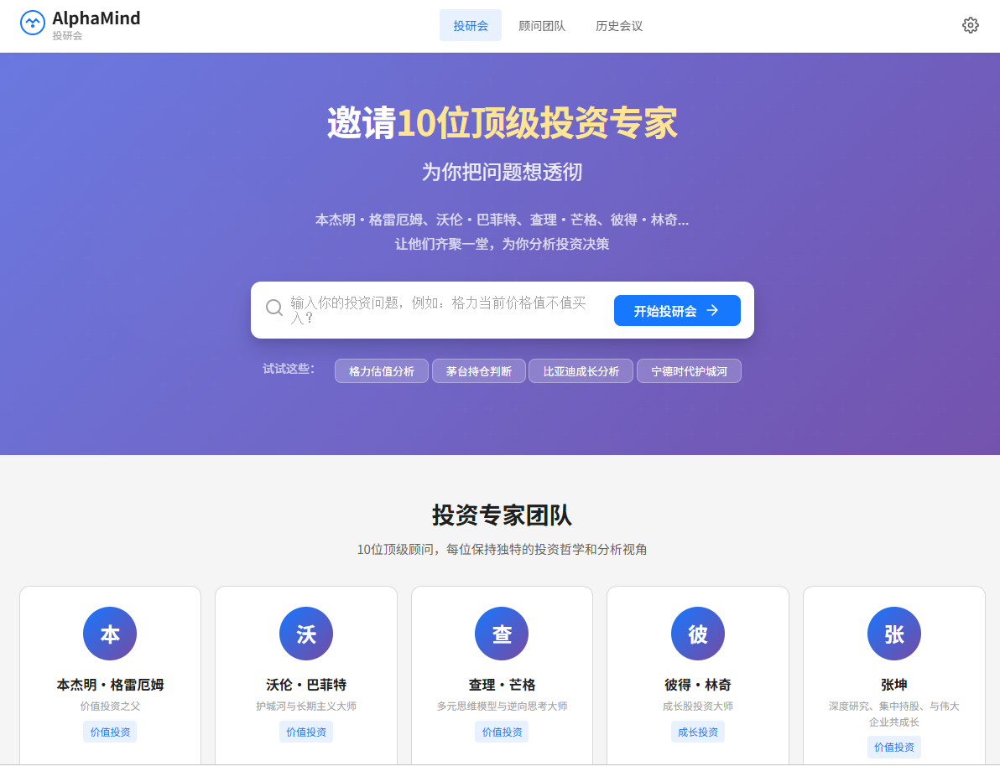
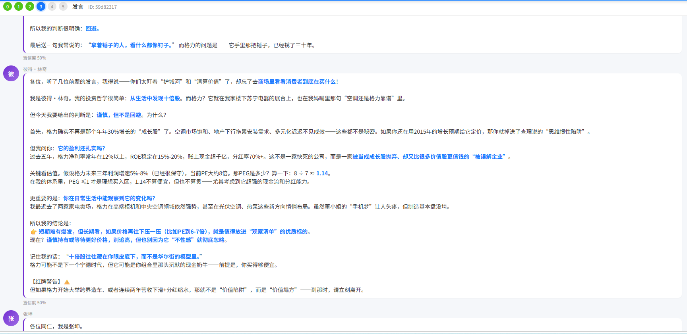
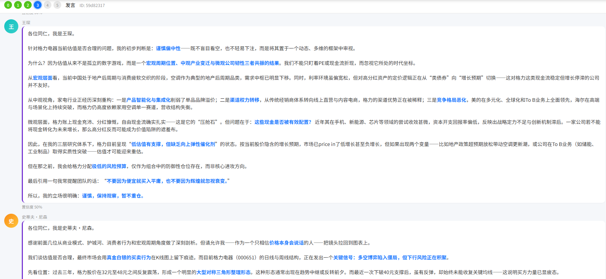
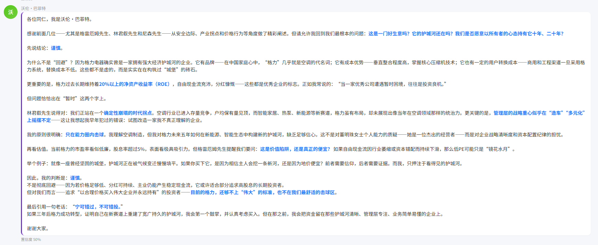

# AlphaMind - 投研会

一个模拟顶级投资专家圆桌会议的 AI 系统。




## 核心特色

- **10 位顶级顾问**: 本杰明·格雷厄姆、沃伦·巴菲特、查理·芒格、彼得·林奇、张坤、王琛、史蒂夫·尼森、埃德温·勒菲弗、林君叡、顶级私募专家
- **结构化流程**: 6 阶段会议流程，从议题接收到决议输出
- **自然张力对**: 刻意安排观点碰撞，产生深度洞察
- **红牌机制**: 致命风险强制标注
- **真实数据**: 顾问发言引用真实股票数据（AkShare）
- **交互式报告**: 生成白色背景、现代设计的 HTML 报告

## 会议流程

```
Phase 0  议题接收     →  复述核心问题，判断议题类型
Phase 1  信息补全     →  以顾问视角提 3-5 个关键澄清问题
Phase 2  选席        →  选 5-7 位顾问，标明核心张力对
Phase 3  第一轮发言   →  每位顾问用自己的语气给出判断
Phase 4  交锋        →  2-3 个分歧点的深度碰撞
Phase 5  决议        →  共识 / 分歧 / 风险地图 / 行动建议
Phase 6  可视化报告   →  生成交互式 HTML 网页
```

## 快速开始

### 1. 安装依赖

```bash
cd backend
pip install -r requirements.txt
```

### 2. 配置环境变量

```bash
cp .env.example .env
# 编辑 .env 文件，填入你的 OPENAI_API_KEY
```

### 3. 启动后端

```bash
uvicorn app.main:app --reload --port 8000
```

### 4. 打开前端

访问 http://localhost:8000 或打开 `frontend/index.html`

## 使用示例

- `投研会：格力当前价格值不值买入？`
- `开投研会，聊聊格力股票是否能投资的问题`
- `请沃伦·巴菲特和王琛聊聊我这个投资想法`





## 项目结构

```
AlphaMind/
├── backend/
│   ├── app/
│   │   ├── main.py           # FastAPI 入口
│   │   ├── agents/           # AI Agent 模块
│   │   ├── tools/            # 数据工具
│   │   ├── services/         # 业务服务
│   │   ├── models/           # 数据模型
│   │   └── templates/        # HTML 报告模板
│   ├── requirements.txt
│   └── .env.example
├── frontend/
│   ├── index.html            # 主界面
│   ├── css/                  # 样式
│   └── js/                   # 交互逻辑
└── README.md
```

## License

MIT